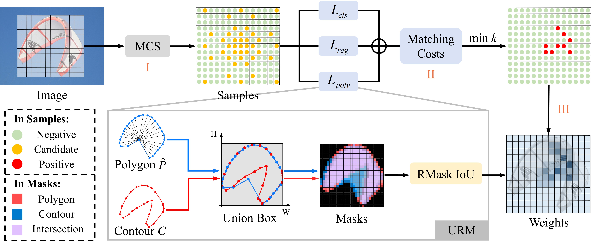
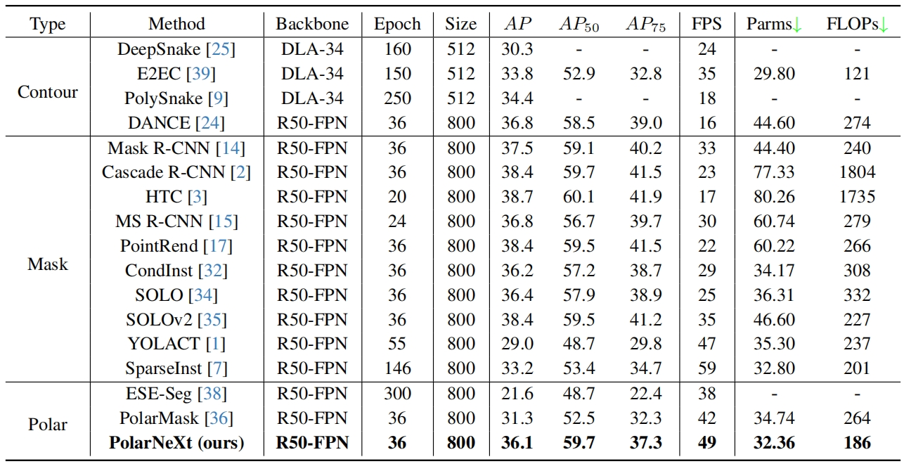

# **PolarNeXt: Rethink Instance Segmentation with Polar Representation**

The code for implementing the **PolarNeXt**. 




## News
- Training code will also be uploaded soon.
- Test code is updated. It supports inference at 49 FPS speed on a single NVIDIA RTX 4090D GPU. (2024.12.10)
- This work has been submitted to CVPR 2025. To ensure anonymity, all information regarding the authors and affiliations will remain undisclosed. (2024.11.15)


## Performances




All the comparison experiments are implemented on the MMDetection toolbox, trained on 2 NVIDIA RTX 4090D GPU with 2 images per GPU, and optimized with SGD.

All inference experiments are conducted on a single NVIDIA 4090D GPU, where FPS, Parms, and FLOPs are calculated separately for inference speed, model complexity, and computational overhead. Notably, in all our experiments, TensorRT or FP16 is not used for acceleration.


## Results and Models
| Backbone | MS train | Lr schd | FPS  | AP val | AP test | Weights |
| :------: | :------: | :-----: | :--: | :----: | :-----: | :-----: |
|   R-50   |    Y     |   3x    |  49  |  35.7  |  36.1   |  model  |
|  R-101   |    Y     |   3x    |  -   |  37.2  |  37.5   |  model  |

Notes:

- All models are trained on MS-COCO *train2017*.
- Data augmentation only contains random flip and scale jitter.


## Installation
Our PolarNeXt is based on [mmdetection](https://github.com/open-mmlab/mmdetection). Please check [INSTALL.md](https://mmdetection.readthedocs.io/en/latest/get_started.html) for installation instructions.

## Testing
Inference testing command:

- ```python tools\test.py projects/PolarNeXt/configs/polarnext_r50_fpn_3x_coco.py checkpoints/polarnext_3x.pth --work-dir logs/polarnext-test```
